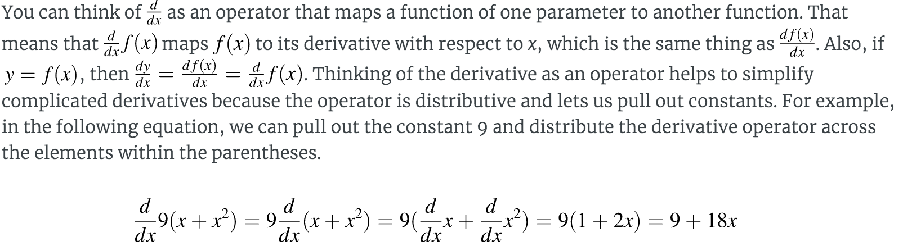
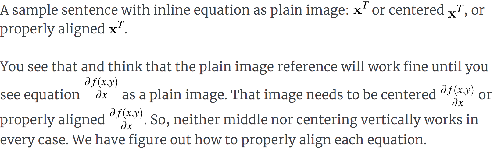

# Bookish -- math-infested markdown to HTML and latex

[Jeremy Howard](http://www.fast.ai/about/#jeremy) and [I](http://parrt.cs.usfca.edu/) wrote up a nice mathy latex document called ``*The Matrix Calculus You Need For Deep Learning*'' that has over 600 equations. We wanted to post it to the web in HTML or markdown but quickly ran into a problem trying to get equations rendered.

In the end we converted the source document to markdown and build a translator that generated [HTML](http://parrt.cs.usfca.edu/doc/matrix-calculus/index.html) using SVG for equations and [PDF](http://parrt.cs.usfca.edu/doc/matrix-calculus.pdf) from native latex equations. It does a pretty good job with html as you can see:

<center>

</center>

All of those equations, even the ones inline in the text paragraph, are `` references.

## What's so hard about rendering equations?

If you're doing markdown or HTML, people tend to use MathJax or its faster cousin Katex. MathJax is just too slow when you have 600 equations. Katex is much better but it (and MathJax) requires every `&`, `_`, etc... be escaped as `\&`, `\_` to avoid getting processed as markdown.  That's no problem because I built a translator that escaped everything for me. Then I found out that the JavaScript parser that extracted the latex equation strings was extremely finicky. I had to randomly insert spaces in my equations trying to get them recognized as equations.

There's another problem.  Is all of that JavaScript gonna work in epub formats? What about the Kindle? Because I'm hoping to write a book on machine learning, I'm leary of relying on full-blown JavaScript to render equations.

I tried pandoc and a few other tools like multimarkdown but not everything came through correctly to the translated output and I got tired of chasing all of this down.

As the [ANTLR](http://www.antlr.org) guy, I ain't afeared of building a language translator and so, following my motto ``*Why program by hand in five days what you can spend five years of your life automating*'', I decided to simply solve this problem by building my own markdown translator.

## How to typeset and display math via SVG

If you can't use JavaScript, you have to use images. If you have to use images, you want scalable graphics, which means SVG files. So, the translator must extract equations and replace them with `` tags referencing SVG files. That part is not too hard; take a look at [Tex2SVG](https://github.com/parrt/bookish/blob/master/src/us/parr/bookish/translate/Tex2SVG.java) and you'll see that I'm just running three programs in sequence to process the equation into an SVG file: `xelatex` then `pdfcrop` then `pdf2svg`.

The really tricky bit is the vertical alignment of equations within a line of HTML text. Check out this sentence with embedded equations:

<center>

</center>

(I had to take a snapshot and show that instead of giving raw HTML plus equations; github's markdown processor didn't handle it properly. haha.)

What does it mean to properly align an equation's image? It's painful.  We need to convince latex to give us metrics on how far the typeset image drops below the baseline. (Latex calls this the *depth*.)  It took a while, but I figured out how to not only compute the depth below baseline but also how to get it back into this Java program via the latex log file. You can see how all of this is done here: [Translator.visitEqn()](https://github.com/parrt/bookish/blob/master/src/us/parr/bookish/translate/Translator.java#L302). Here is the latex incantation to extract height and depth of the rendered equation:

```tex
\begin{document}
\thispagestyle{empty}
<body>
\setbox0=\vbox{<body>\}
\typeout{// bookish metrics: \the\ht0, \the\dp0\}
\end{document}
```

where `<body>` is the hole where the equation goes.

Oh, and to get the font to look less anemic, you need to set the math fonts:

```tex
\DeclareSymbolFont{operators}   {OT1}{ztmcm}{m}{n}
\DeclareSymbolFont{letters}     {OML}{ztmcm}{m}{it}
\DeclareSymbolFont{symbols}     {OMS}{ztmcm}{m}{n}
\DeclareSymbolFont{largesymbols}{OMX}{ztmcm}{m}{n}
\DeclareSymbolFont{bold}        {OT1}{ptm}{bx}{n}
\DeclareSymbolFont{italic}      {OT1}{ptm}{m}{it}
```

One last little tidbit. Image file names are based upon the MD5 digest hash of the equation. There are two benefits: (1) repeated equations share the same file and (2) latex is slow, like 1 second per equation, but the hashed filename lets us cache all of the images and know when we must refresh an image because the equation changed.  

It's safe to stop reading here.  You can learn everything you need to know about doing this yourself from this description and the source code.  This repository is just getting started and is in progress so don't expect a tool you can use yourself, at least at the moment.

## What's in this repository?

This repository contains a **prototype** Java program (with maven build and intellij project files) that knows how to read a ``standard'' markdown file with a few augmentations. It knows how to generate either latex or HTML, but it's all hardcoded right now.  You should think of this as a reference for building your own tool, rather than something I'm going to maintain for anybody but myself. haha.   

There is lots of hideous cut-and-paste programming, which is how I build any prototype until I figure out what I'm doing.

Unlike any other markdown processor I've seen, this one has [an actual lexer](https://github.com/parrt/bookish/blob/master/src/us/parr/bookish/parse/BookishLexer.g4) and [parser](https://github.com/parrt/bookish/blob/master/src/us/parr/bookish/parse/BookishParser.g4)!

You will also notice that I have built this program as if it were a programming language.  The strategy I use is to construct a model of the document from the parse tree using a visitor. Then I use a [fiendishly clever bit of code](https://github.com/parrt/bookish/blob/master/src/us/parr/bookish/translate/ModelConverter.java) to automatically convert that representation of the document into a tree of [string templates](http://www.stringtemplate.org).  Of course the set of templates you use determines what output you get.  Change the templates and you change the target language. For example here are the [HTML templates](https://github.com/parrt/bookish/blob/master/resources/templates/HTML.stg).